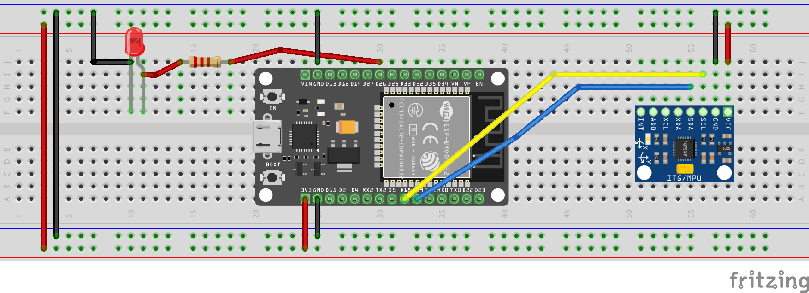
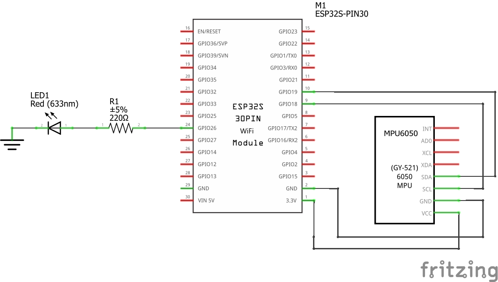
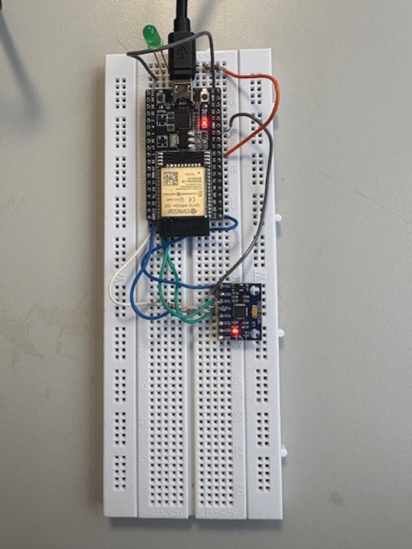
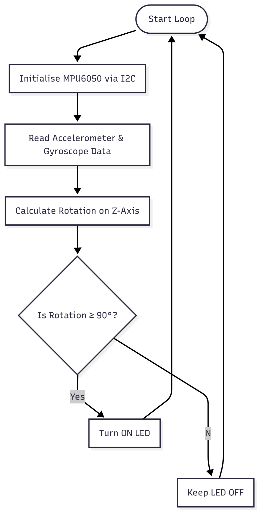

# MPU6050 Rotation Detection (ESP32)

An ESP32-based rotation detection project using the MPU6050 gyroscope and accelerometer. The system measures angular velocity, calculates rotation about the Z-axis (yaw), and activates an LED when approximately 90° of rotation is detected.

## Demo / Images

### Breadboard Diagram



### Circuit Schematic



### Actual Breadboard Implementation



### Rotation Detection Flowchart



### Fritzing Project

The editable circuit design is available in [wiring.fzz](docs/wiring.fzz).

For additional circuit documentation, see the [docs folder](docs/README.md).

## Hardware

- ESP32 development board
- MPU6050 gyroscope and accelerometer module
- LED
- Current-limiting resistor
- Breadboard and jumper wires

### Pin map

| Connection | ESP32 |
|---|---|
| MPU6050 VCC | 3.3V |
| MPU6050 GND | GND |
| MPU6050 SDA | GPIO19 |
| MPU6050 SCL | GPIO18 |
| LED positive (via resistor) | GPIO26 |
| LED negative | GND |

These are the pin assignments selected for this repository's Arduino implementation.

## How it works

1. The ESP32 initialises I2C communication with the MPU6050.
2. The MPU6050 measures acceleration and angular velocity along the X, Y and Z axes.
3. The ESP32 retrieves gyroscope readings along the Z-axis.
4. Angular velocity is integrated over time to estimate the yaw angle.
5. The LED turns on when the estimated rotation reaches approximately 90°.

The MPU6050 is a 6-axis inertial measurement unit (IMU), combining a 3-axis accelerometer and a 3-axis gyroscope.

The gyroscope measures angular velocity in radians per second. By multiplying angular velocity by elapsed time, the ESP32 can estimate the change in orientation.

The rotation calculation is:

`Yaw = Previous Yaw + (Angular Velocity × Time Interval)`

A 90° rotation corresponds to approximately 1.5708 radians.

## Build & run

1. Open the Arduino IDE.
2. Install ESP32 board support.
3. Install the following Arduino libraries:
   - Adafruit MPU6050
   - Adafruit Unified Sensor
   - Adafruit BusIO
4. Connect the MPU6050 and LED to the ESP32 using the pin map above.
5. Open `mpu6050-rotation-detection.ino`.
6. Select the correct ESP32 board and serial port.
7. Upload the Arduino sketch.
8. Open the Serial Monitor at 115200 baud to observe the yaw angle.
9. Rotate the sensor around its Z-axis to test the LED response.

## Code overview

The program uses the following libraries:

- `Wire.h` — establishes I2C communication between the ESP32 and MPU6050.
- `Adafruit_MPU6050.h` — provides functions for configuring and reading the sensor.
- `Adafruit_Sensor.h` — provides sensor event data structures.

### Sensor initialisation

```cpp
Wire.begin(I2C_SDA_PIN, I2C_SCL_PIN);

if (!mpu.begin()) {
    Serial.println("Failed to find MPU6050 chip");
    while (1) {
        delay(10);
    }
}
```

This initialises I2C communication and checks whether the MPU6050 can be detected.

### Reading sensor data

```cpp
sensors_event_t accel, gyro, temp;
mpu.getEvent(&accel, &gyro, &temp);
```

The MPU6050 provides acceleration, angular velocity and temperature measurements.

### Calculating rotation

```cpp
float rotationZ = gyro.gyro.z;
yaw += rotationZ * deltaTime;
```

Angular velocity from the Z-axis is integrated over time to estimate yaw.

The gyroscope output is measured in radians per second, and `deltaTime` is measured in seconds. Therefore, the calculated yaw is expressed in radians.

### LED rotation detection

```cpp
if (yaw >= 1.5708) {
    digitalWrite(LED_PIN, HIGH);
} else {
    digitalWrite(LED_PIN, LOW);
}
```

The LED activates when the accumulated positive yaw angle reaches approximately 90°.

## Results / notes

The MPU6050 was integrated with the ESP32 to demonstrate rotation detection using gyroscope measurements.

The original laboratory report records successful sensor operation and LED activation when the rotation threshold was reached.

The Arduino code in this repository has been updated to use a more accurate 90° threshold of 1.5708 radians. This revised version has not been independently hardware-tested.

### Limitations

- Gyroscope measurements contain noise.
- Small measurement errors accumulate over time, causing yaw drift.
- The calculated angle is an estimate rather than an absolute orientation measurement.
- The threshold detects accumulated positive rotation rather than rotation in both directions.
- Recalibration or sensor fusion could improve long-term accuracy.

## What I learned

- How to interface an MPU6050 with an ESP32 using I2C communication.
- How accelerometers and gyroscopes measure movement and rotation.
- How to retrieve and interpret gyroscope data.
- How angular velocity can be integrated over time to estimate rotation.
- How to control an LED using real-time sensor measurements.
- Why sensor noise, calibration and measurement errors matter in embedded systems.

## Credits

Developed as part of an Electrical and Electronic Engineering laboratory project.

**Hardware:**
- ESP32 microcontroller
- MPU6050 gyroscope/accelerometer

**Software:**
- Arduino IDE
- Adafruit MPU6050 library
- Adafruit Unified Sensor library
- Adafruit BusIO library

## License

This project is licensed under the MIT License. See [LICENSE](LICENSE) for details.
